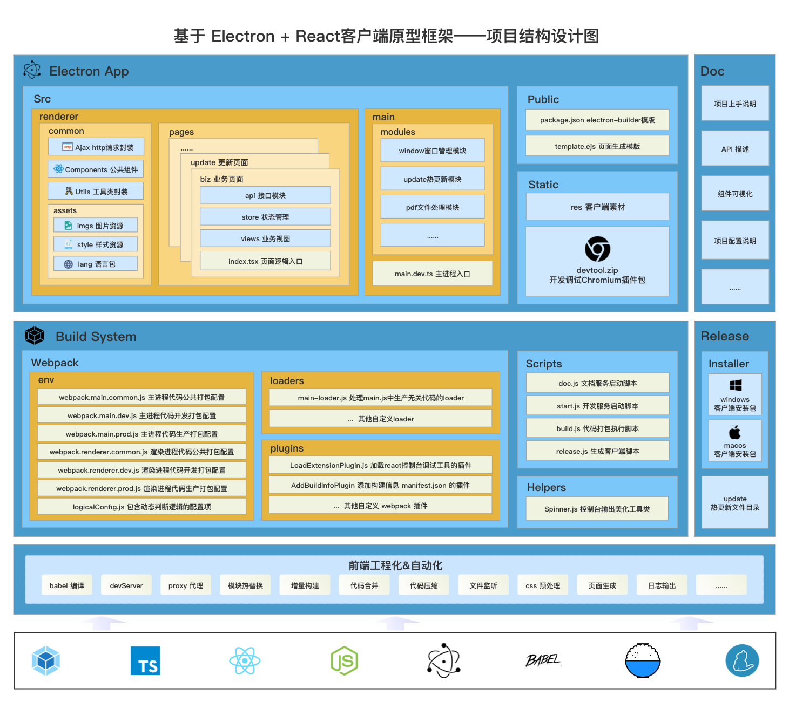
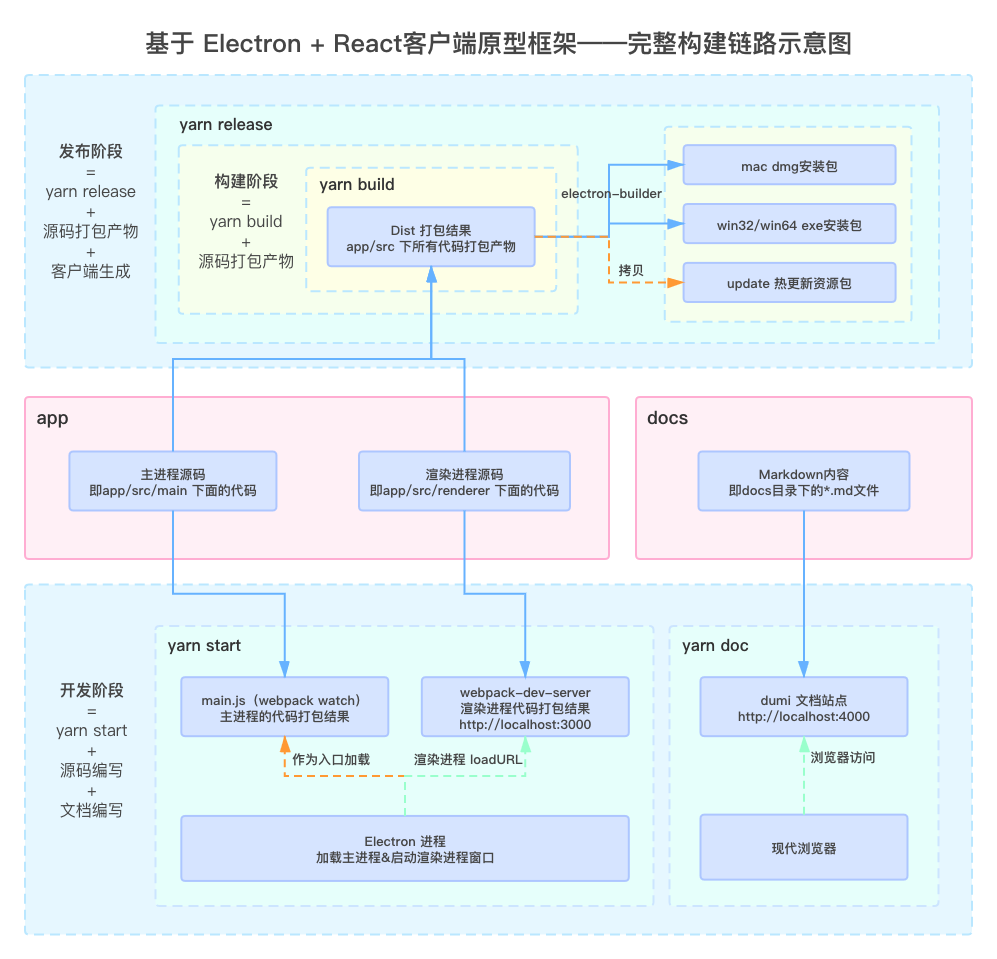

# electron-typescript-react-boilerplate

##  PUDDING

PUDDING 是一款基于 React + TypeScript + Webpack 搭建的 Electron 客户端脚手架。

<div class="pic-plus">
  
  <span>+</span>
  
</div>


## 特性

- ⚡️ hmr、electron自动重载
- 🛡 TypeScript 开发支持
- 🍭 prettier、eslint 集成
- 🛠 react-devtool调试工具集成
- 📚 基于dumi的可视化文档集成
- 📦 完善的 webpack 打包配置
- 🖥 支持打包 win/mac 安装包
- 💥 客户端热更新功能支持
- ✨ commitizen规范代码提交
- ...

## 基本信息

<table>
	<tr>
	    <th>跨平台桌面客户端框架</th>
	    <th>HTML+CSS+JS 开发</th>
	    <th>前端工程化</th>  
	</tr >
	<tr >
	    <td rowspan="4"><code>Electron</code></td>
	    <td>CSS-IN-JS 库：<code>Styled-Components</code></td>
	    <td>代码编译工具：<code>Babel</code></td>
	</tr>
	<tr>
	    <td>JS MV* 框架：<code>React</code></td>
	    <td>模块打包工具：<code>Webpack</code></td>
	</tr>
	<tr>
	    <td>页面 UI 组件库：<code>Ant Design</code></td>
	    <td>文档直出工具：<code>Dumi</code></td>
	</tr>
	<tr>
	    <td>JS 语言增强：<code>TypeScript</code></td>
	    <td>代码格式规范工具：<code>Prettier</code></td>
	</tr>
</table>

Electron 内代码运行环境

|  Chromium |  Node |
| ------------------------------------------------------------------------------------------ | -------------------------------------------------------------------------------- |
| v85.0.4183.121                                                                             | v12.16.3                                                                         |


目录结构

`app目录`即管理源代码及进行业务开发的目录

`build目录`管理了整个项目的 Webpack 构建相关文件 以及 启动开发服务、进行打包、执行发布的 npm scripts 脚本

`docs目录`负责管理项目文档的所有内容

`release目录`存放执行发布命令执行后输出的最终客户端产物

下列通过非标准的矩形树图的形式展示了整个项目结构的俯瞰图：




构建链路流程如下图：



## 快速上手

#### 环境

`PUDDING`的运行和启动依赖 Node 运行环境，需要提前安装 [node](https://nodejs.org/en/) 并确保 node 版本是 12.16.3 或以上。


克隆仓库

```git
git clone https://github.com/hx-dl/electron-ts-react-boilerplate.git project-name
```

安装依赖

```
yarn
```

启动开发服务
```shell
# cd 到项目跟目录下
yarn start
```

启动文档服务

```shell
yarn doc
```

代码打包

```shell
# 打包产物会输出到 app/dist 目录
yarn build
```

生成客户端

```shell
# 客户端安装包会输出到 release/installer 目录
# 热更新资源包位于 release/update 目录
yarn release
```
